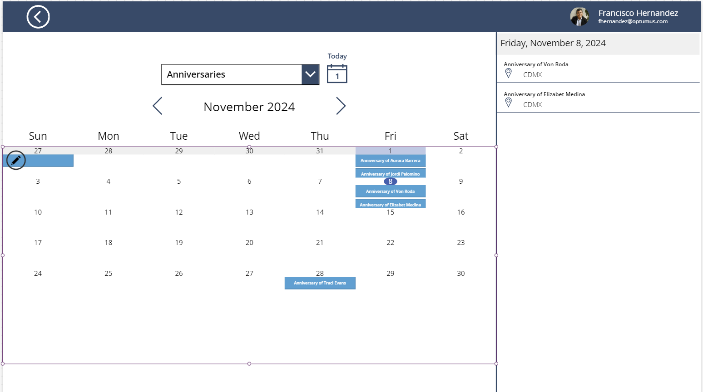

# [Calendar](@id CalendarScreen)

Here, users can consult important dates such as Work Anniversaries, Birthdays, Holidays and Care One On Ones for current year. PowerApps performance can be compromised if we try to set up a multi-year calendar as items in collections become large, and the application turns laggy. 



On the left we have a dropdown to select the type of events to display in the calendar, 

The **OnVisible** property of the screen initializes all relevant variables required to make this calendar application work: 

```
/*resets calendar view and date selection to today*/
Set(_dateSelected, Today());
Set(_firstDayOfMonth, DateAdd(Today(), 1 - Day(Today()), TimeUnit.Days));
Set(_firstDayInView, DateAdd(_firstDayOfMonth, -(Weekday(_firstDayOfMonth) - 2 + 1), TimeUnit.Days));
Set(_lastDayOfMonth, DateAdd(DateAdd(_firstDayOfMonth, 1, TimeUnit.Months), -1, TimeUnit.Days));
ClearCollect(
    calendarEvents,
    {}
);
```
We control the visibility of this screen using three main galleries, and a dropdown: 


- **DropdownCalendarSelection**: Items here are defined by user role, and the options are:  [
        "Anniversaries",
        "Birthdays",
        "Holidays",
        "Care One on Ones"
    ]. The **OnSelect** property sets the calendar visibility when user selects an item

```
//Template to fill calendar events
 ForAll(
        Filter('OPT - Employees Informations','Employment Status'="Active"),
        If(
            !IsBlank(ThisRecord.DOB),
            Collect(
                calendarEvents,
                {
                    Start: DateTimeValue(
                        Text(
                            Month(ThisRecord.DOB),
                            "00"
                        ) & "-" & Text(
                            Day(ThisRecord.DOB),
                            "00"
                        ) & "-" & Text(
                            Year(Today()),
                            "00"
                        )
                    ),
                    Location: "CDMX",
                    Subject: "Birthday of " & ThisRecord.Name,
                    Id: DateDiff(
                        DateValue("1/1/1990"),
                        Now(),
                        TimeUnit.Milliseconds
                    )
                }
            )
        )
    )
```

- **MonthDayGallery1**: Items property contains numbers to generate 42 squares in the calendar, so it displays last days from previous month and first days of the nect when applicable.  Each element contains a sub gallery **GalleryEvents**


## Miscellaneous Elements