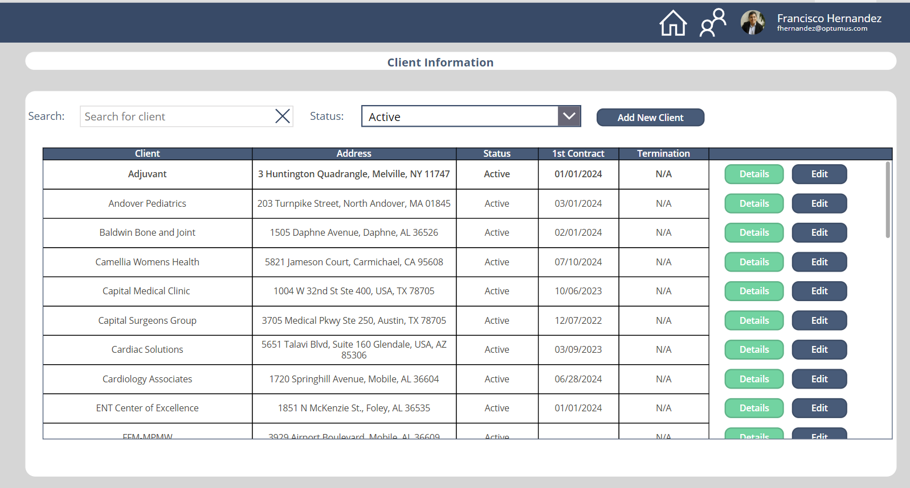
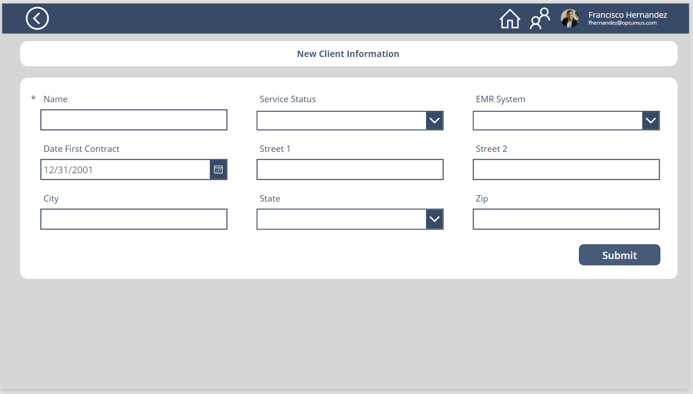
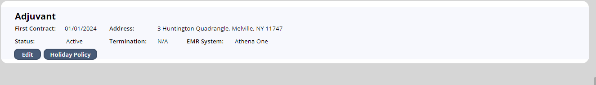
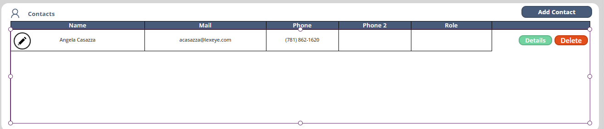
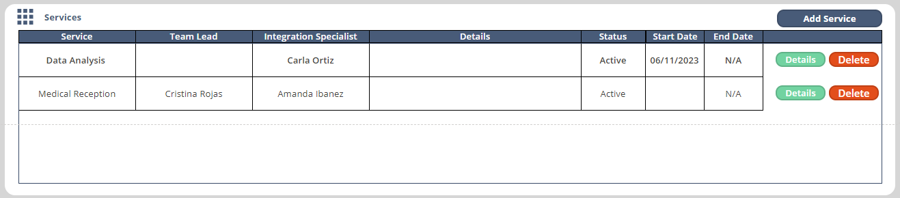
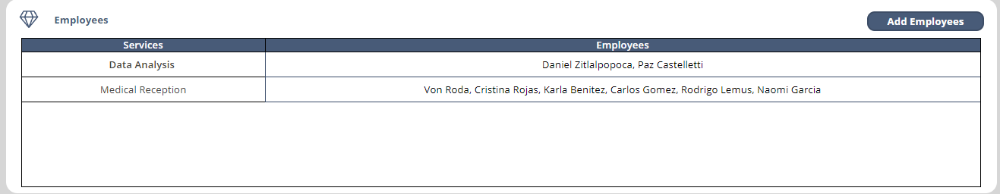
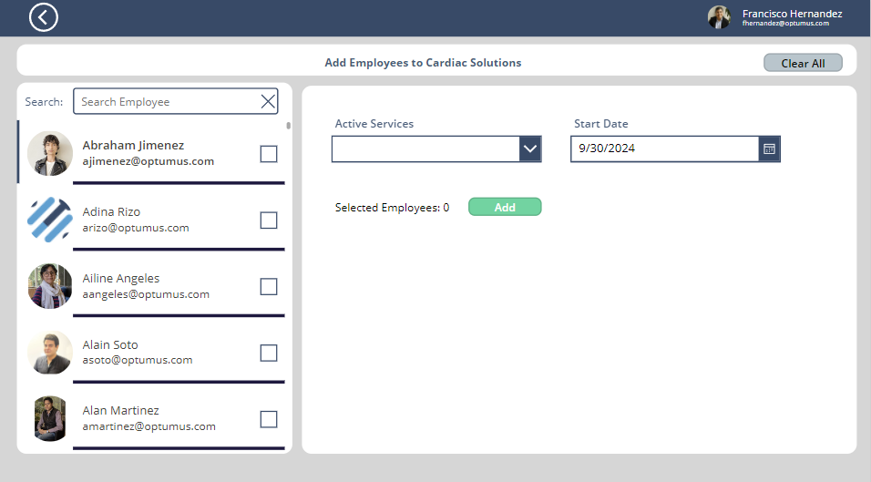
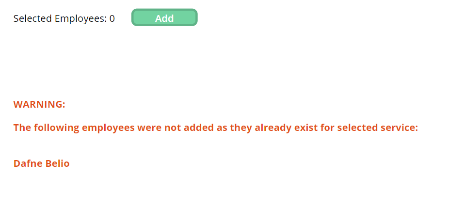

# [Client's Section](@id ClientsSection)


This screen allows to search and preview information of clients. The only filter condition here is the status of the contract which can be "Active", "Prospect" or "Terminated". One can also add a new record if deemed necessary.



The data in the gallery (**GalleryClients**) is retrieved from the **OPT - Customers Tables** sharepoint list. The OnVisible property of the screen pulls the information into a collection: 

```
ClearCollect(customersColl,'OPT - Customers Tables')
```

This data is pulled, filtered and sorted on the Items property of the gallery: 
```
If(!IsBlank(txtSearchClient.Text) ||!IsBlank(DropdownStatusFilter.Selected.Value),
//then
Sort(Filter(
    customersColl,
    txtSearchClient.Text in Name,
    If(!IsBlank(DropdownStatusFilter.Selected.Value),
    'Service Status' = DropdownStatusFilter.Selected.Value, 'Service Status' <> Blank())
),Name),
//else
Sort(customersColl,Name
))
```


## [Add New/Edit Client](@id addClient)

By pressing "Add New Client" or "Edit", the following code is executed: 
```

Set(
    varDataEditCustomer, 
    Blank()); // for New Client

Set(
    varDataEditCustomer, 
    ThisItem
); // For a client item

Navigate(scrAddCustomer,ScreenTransition.Fade,{varDataEditCustomer:varDataEditCustomer});

```

the **varDataEditCustomer** context variable controls the info displayed on the FormNewClient element. 


If we click on the "Add New Client" or "Edit" buttons this screen will be displayed: 



General functionality of forms is described in the [Miscellaneous](@ref Miscellaneous) section.


## [Client Details](@id clientDetails)
When navigating to this window we pass the following command: 
```
Navigate(scrServices,ScreenTransition.Fade,{varCustomerDetails:ThisItem});
```

This **varCustomerDetails** context variable contains all information stored for this client in the **OPT - Customers Tables** SharePoint list. 

The Client Details screen has four different sections: 

1. Client Info: The displayed info is pulled from the varCustomerDetails context variable. The "Edit" button navigates the user to the  [Edit Client](@ref addClient) screen, and the "Holiday Policy" is referred as in the [Holidays](@ref HolidaysScr) section of the administration module.

    

2. Contacts: Displays the information linked to a specific client from the **OPT - Clients Contacts** table. This section functions as a regular form element as described in [Miscellaneous](@ref Miscellaneous). 

    

3. Services: Displays the information linked to a specific client from the **OPT - Client Services** table. This section functions as a regular form element as described in [Miscellaneous](@ref Miscellaneous). 

    

4. Employees: Displays the employees linked to a specific client and their services. This section is more complex than the previous ones as it involves three tables: **OPT - Customers Tables**, **OPT - Client Services**, and **OPT - Employee Clients**. 

     
    
    The table itself displays information by grouping the **servicesEmployeeClientColl** collection by service: 
    ```GroupBy(
    Sort(servicesEmployeeClientColl,Service),
    Service,
    DATA
    )
    ```
    
    This collection is defined in the **OnVisible** property of the screen:
    
```
Set(CustomerID, varCustomerDetails.UniqueCustomerID);
//Pulls customerId from context variable

UpdateContext({varCustomerDetails:LookUp(
    'OPT - Customers Tables',UniqueCustomerID=CustomerID)}); 
//Pulls most  up to date information from customers table

ClearCollect(
    ClientServicesColl,
    Filter(
        'OPT - Client Services',
        UniqueCustomerID = varCustomerDetails.UniqueCustomerID,
        'Service Status' = "Active"
    )
);//Retrieves Services linked to specific client

ClearCollect(
    servicesEmployeeClientColl,
    ForAll(
        Filter(
            'OPT - Employee Clients',
            UniqueCustomerID = varCustomerDetails.UniqueCustomerID,
            'Role Status'="Active"
        ),
        If(
            !IsBlank(
                Filter(
                    ClientServicesColl,
                    ServiceID = ThisRecord.ServiceID
                )
            ),
            ThisRecord
        )
    )
) // Retrieves employees linked to that specific service/client
```

## [Add Employees Screen](@id clientAddEmployee)

Here one can add active employees in bulk to active services for the selected client. You can access the **Add Employees Screen** from the "Add Employees" button in the section above. This button executes a basic snippet to navigate to the screen and pass a context variable with client details: 

```
Navigate(scrAddBulkEmployees,ScreenTransition.Fade,{varCustomerDetails:varCustomerDetails});
```



The **OnVisible** property of the screen defines all variables that make the functionality of this screen: 

```
ClearCollect(Employees, Filter('OPT - Employees Informations', 'Employment Status'="Active")); 
//Active Employees

ClearCollect(ColEmployees, AddColumns(Employees, IsChoosen, false));
//Creates a new collection from active employees, and it includes 
an additional column to store the state of the selection checkbox

Set(varActiveServiceList,
    Filter(
        'OPT - Client Services',
        UniqueCustomerID = varCustomerDetails.UniqueCustomerID, 
        'Service Status' = "Active"
    )
);
//Active services from current client
 

ClearCollect(NonSuccessfulUsers, {Name:""})
//Collection that stores employees that were not successfully added.
```


!!! note "Note"
    Employees can only be removed from a client, or change status by accessing their individual profiles. 

The **CheckboxSelectedEmployee** within the **GalleryEmployees** object controls which users will be assigned to the selected service. Using the **OnCheck** and **OnUncheck** properties: 

```
Patch(ColEmployees,ThisItem,{IsChoosen:true}) //OnCheck property

Patch(ColEmployees,ThisItem,{IsChoosen:false}) //OnUncheck property
```
Finally, the **add** button validates the fields, and patches the information to the  'OPT - Employee Clients' table. 

```
//Validate inputs
If(
    IsBlank(DropdownActiveServices.Selected.Service) || IsBlank(DatePickerService.SelectedDate),
    Notify(
        "Please select both a Service and a Start Date",
        NotificationType.Error
    ),
    ClearCollect(
        NonSuccessfulUsers,
        {Name: ""}
    );
    Clear(tempMail);
    
    ForAll(
        ColEmployees,
        If(
            ThisRecord.IsChoosen,
    //Then
            Collect(tempMail,{Mail:ThisRecord.'Email Address'});
            If(
                IsEmpty(
                    Filter(
                        'OPT - Employee Clients',
                        'Email Address' = Last(tempMail).Mail,
                        UniqueCustomerID = varCustomerDetails.UniqueCustomerID,
                        ServiceID=DropdownActiveServices.Selected.ServiceID
                       
                    )
                ), //PowerApps doesn't allow to set variables within a for loop,
                // so I have to use a collection and use the last item as the value of my variable
            //THEN
                Patch(
                    'OPT - Employee Clients',
                    Defaults('OPT - Employee Clients'),
                    {
                        Client: varCustomerDetails.Name,
                        UniqueCustomerID: varCustomerDetails.UniqueCustomerID,
                        Service: DropdownActiveServices.Selected.Service,
                        ServiceID: DropdownActiveServices.Selected.ServiceID,
                        'Role Status': "Active",
                        'Start Date': DatePickerService.SelectedDate,
                        Name: ThisRecord.Name,
                        'Email Address': ThisRecord.'Email Address',
                        'User System ID': ThisRecord.'User System ID'
                    }
                );, //I patch the employee if it's not yet assigned to this client/service
                //ELSE
                Patch(
                    NonSuccessfulUsers,
                    Defaults(NonSuccessfulUsers),
                    {Name: ThisRecord.Name}
                );
            );
            
        );
    );
    Reset(DropdownActiveServices);
    Notify(
        "Records Added to Database",
        NotificationType.Success
    );
    UpdateIf(
        ColEmployees,
        true,
        {IsChoosen: false}
    );
    
)//End validation If

```

The function also triggers the message below when some employees failed to patch:



The label **LabelWarningExisitingEmployee** contaning this message is hidden when the **NonSuccessfulUsers** collection is empty: 

```
//Code at the OnVisible property of the label
IsBlank(LookUp(NonSuccessfulUsers, !IsBlank(Name)))
```