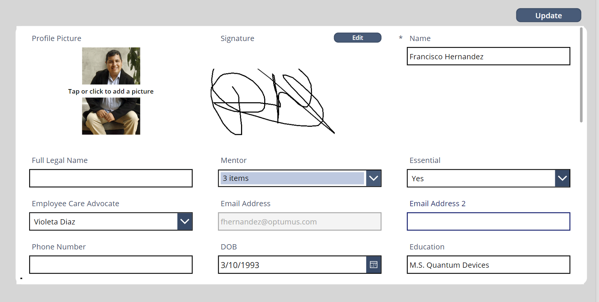
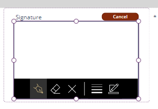
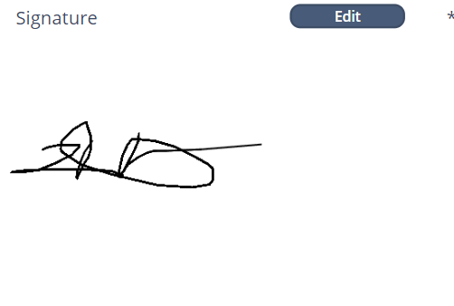

# [Employee Profile Form](@id EmployeeProfileForm)

This screen can be accessed from the [Employee Profile](@ref EmployeeProfileScr) section. While it functions similarly to a regular [Form](@ref formSubmit) item which submits updates to the 'OPT - Employees Informations' table, it contains specific functionalities worth highlighting. 

## Profile Picture 
The image field type is automatically added from the PowerApps form layout. Keep in mind that the image is stored as a **Base64** url, so to display it outside the forms and PowerApps environment it is necessary to decode the string. 

## Signature
In the 'OPT - Employees Informations' table, the column signature is of type text, and we intend to store a Base64 String that contains signature information. The **Edit/Cancel** button controls the state of the variable **editSignatureEmployee** for different visibilities, and it also sets the signature string to Blank() or new value if a change is registered.
 
```
Set(varSignatureEmployee,Blank());
Set(editSignatureEmployee,true)
```
 
There are two visibilities. The first displays when either **editSignatureEmployee** is set **true** or if there is no signature on file: 



What we have here is only a Pen Input component which will input the data from the users, and from which the **varSignatureEmployee** will get its value. The image information is codified when submiting the form: 

```
 If(
        IsBlank(varSignatureEmployee),
        Set(
            varSignatureEmployee,
            Substitute(
                JSON(
                    SignInput.Image,
                    JSONFormat.IncludeBinaryData
                ),
                Char(34),
                ""
            )
        )
    );
```
This **varSignatureEmployee** is what controls the value to push in the table. When a signature is found in file the user will have this visibility: 



This component is a simple image object which can decode the Base64 url we previously set with no additional steps. 

## Update Button 
This button controls the behavior of the form for submission. It also sends out probation notifications if the conditions are met. Luis added an update to update Inventory assets on the 'INM - Assets Log' table. 


## OnSuccess Property
After a successful submission, this property sends out notifications of EC Advocate updates to the employee, and refreshes the **varEmployeeDatarow** variable with most up to date information: 

```

//Sends notification if new Advocate
If(DropdownECAdvocate.Selected.Value <> varEmployeeDataRow.'Employee Care Advocate',
Patch('OPT - Employee Advocate Notification',
    Defaults('OPT - Employee Advocate Notification'),

    {   
        Advocate:DropdownECAdvocate.Selected.Value,
        Subject:"New EC Advocate has been assigned",
        Receipients:varEmployeeDataRow.'Email Address',
        Body:varEmployeeDataRow.Name
    }

));

//Refresh varEmployeeDataRow variable
Set(varEmployeeDataRow, LookUp('OPT - Employees Informations', 'User System ID'=varEmployeeDataRow.'User System ID'));
```
