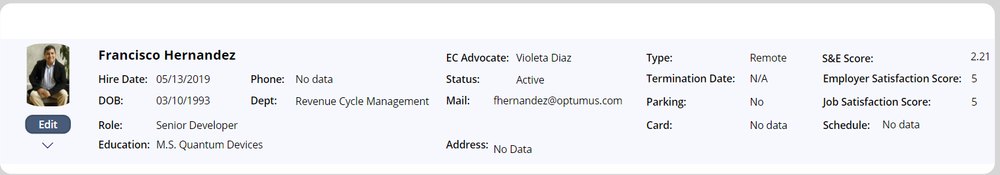

# [Employee Profile](@id EmployeeProfileScr)

One can access their own employee profile screen from the [Main Screen](@ref MainAppScr) by clicking the **Profile** button. Dev, Administrators, Integration, and S&E Specialists users have different levels of access to other users' profiles through the magnifying glass icon on the top-right corner or by clicking on the **Employees** button on the [Main Screen](@ref MainAppScr).

Either way, the buttons will set the **varEmployeeDataRow** which contains all information about the selected user. This variable is of special interest as it controls all the subsequent functionalities: 

```
Set(
    varEmployeeDataRow,
     LookUp(
            'OPT - Employees Informations',
            'Email Address' = userMail
        )
);

```
The **varSelectedPerson** context and global variables are also set when loading the employee profile. Some functionalities make use of them, but they will be eventually deprecated. They were part of the initial approach before this project grew significantl and before the creation of the the 'OPT - Employees Informations' table. Proceed with caution if you need to manipulate anything involving them:

```
UpdateContext(
        {
            varSelectedPerson: {
                Mail: varEmployeeDataRow.'Email Address',
                Id: varEmployeeDataRow.'User System ID',
                DisplayName: varEmployeeDataRow.Name
            }
        }
    );
    Set(
        varSelectedPerson,
        varSelectedPerson
    );
```

## [Initial Load](@id initialLoad)
When accessing this screen, a series of background processes are triggered by the **OnVisible** property of the window. In this section I will explain some pieces of this code which are not used by other areas. I will refer to the remaining snippets in their respective sections.

### [Variable definitions] (@id initialLoadDefs)
- The first variable we define is the context type **resetCanHome**, which resets the screen's scrolling state. This variable is applied to the **Visible** property of the **CanvasProfileScrollingCard** object, and it is triggered when the screen state changes between hidden and visible. 
```
UpdateContext({resetCanHome:false}); //Resets scrolling 
```

- The **varShowEmployeeDetails** controls the **Visible** property of the **AdditionalEmployeeInfo** container which displays further data about the employee. 

```
Set(
        varShowEmployeeDetails,
        false
    );
```

## Navigation Buttons


A detailed explanation of this part can be found at [Miscellaneous - Navigation Buttons](@ref NavigationButtonms) section.


## [Employee Information](@id EmployeeProfileInfo)



The information displayed in this section comes from multiple sources. General data is retrieved from the **varEmployeeDataRow** global variable, while the scores are calculated from their respective tables. each label uses a conditional statement to display either a "N/A" or the actual value for the current Employee visibility. In the case of the picture we set a generic **optumus_default** png if no information is found: 

```
If(!IsBlankOrError(varEmployeeDataRow.'Profile Picture'), 
varEmployeeDataRow.'Profile Picture'.Full, 
optumus_default
)
```

The small **Edit** button navigates the user to [update](@ref EmployeeProfileForm) the Employee profile. 


### Download profile picture 
To download the profile picture, the user can click on the photo and it will copy a base64 url containing the image to the user's PC clipboard. I suggested to Employee Care to paste this URL onto the browser, and then download the picture. The **OnSelect** property of the picture executes the following: 
```
Copy(Substitute(JSON(Self.Image,JSONFormat.IncludeBinaryData),Char(34),""));
Notify("URL Correctly retrieved, please paste on your browser to download picture",NotificationType.Success)
```

!!! note "Note"
    I realize this is a convoluted method for downloading a picture, but as of Fall 2024, it’s not currently possible to execute a "Download" or "Run" command on base64 URLs provided by "Image" type columns to directly download or open them in the local browser, unlike with an attachments-type column. I'm unsure whether using DataVerse (a paid option) would simplify this process.

### Score Calculation
There are three score fields in this section: **S&E Score**, **Employer Satisfaction Score**, and **Job Satisfaction Score**, for which we have the **SEAverage**, **optumusAverage** and **satisfiedAverage** variables, respectively. The procedure for calculating these scores follows the standard average formula: the total score entries for the current employee are summed and divided by the total number of rows in the table. 

```
ClearCollect(SERevs,Filter('OPT - Employees SE Reviews', 'User System ID'=varEmployeeDataRow.'User System ID'));
Set(totalSumSE,
    CountRows(SERevs)
);
Set(SEAverage,
    If(totalSumSE = 0, 0,Sum(SERevs,Value(Score))/totalSumSE)
);
```

An analogous procedure is followed for the **optumusAverage** and **satisfiedAverage** scores, but in these cases using the 'OPT - Employee Care One On Ones' table with the 'Optumus Satisfaction Score' and 'Satisfied Score' columns.

### Additional Employee Information 
