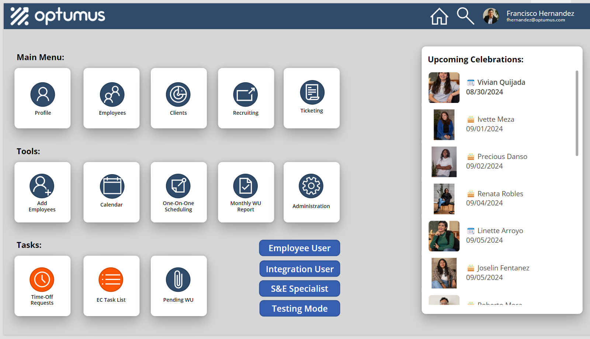
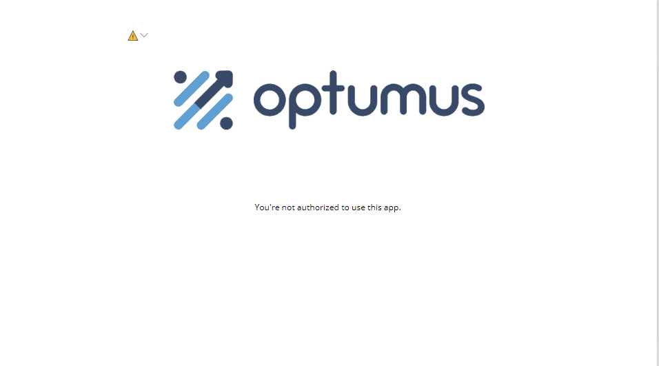
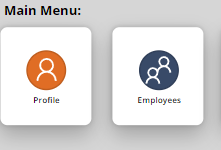

# [Main Screen] (@id MainAppScr)

The main screen, named "scrDashboard" in the Tree View of PowerApps, is presented here: 



There are different visibilities that can be accessed using the buttons labeled "Employee User", "Integration User", etc., which are used to test different levels of access to the functionalities of the application. The visibility on the screenshot above corresponds to what a user in "Dev" mode observes. 

```
Set(UserRoleGlobal,"Employee");
Set(UserRole,"Employee");
UpdateContext({UserRole:"Employee"});
```

Immediately after the application starts, the code in the "OnVisible" property of the window will be executed, followed by pieces of code in hidden elements. The most important pieces of code are discussed here. 

- OnVisible Property:
 ```
Set(
    userMail,
    If(
         IsBlank(LookUp(
        'OPT - Employees Informations',
        'User System ID' = Text(User().EntraObjectId))),
        
        LookUp(
        'OPT - Employees Informations',
        'Email Address 2' = User().Email).'Email Address',


         LookUp(
        'OPT - Employees Informations',
        'User System ID' = Text(User().EntraObjectId)).'Email Address'

    )
    
);
Set(
    UserRole1,
    If(
        IsBlank(
            LookUp(
                'OPT - Admin Schemas',
                'Email Address' = userMail
            ).Role
        ),
        LookUp(
            'OPT - Admin Schemas',
            'Email Address 2' = userMail
        ).Role,
        LookUp(
            'OPT - Admin Schemas',
            'Email Address' = userMail
        ).Role
    )
);
Set(
    UserRole,
    UserRole1
);
Set(
    UserRoleGlobal,
    UserRole1
);
UpdateContext({UserRole: UserRole1});
Set(
    userInfo,
    LookUp(
        'OPT - Employees Informations',
        'Email Address' = userMail
    )
);
```
User access to the application is based on the email address registered within the application. As I understand it, only users in the Optumus Active Directory should be able to access it. However, to add an extra layer of security, I ensure that the logged-in user is registered in both the 'OPT - Employees Information' and 'OPT - Admin Schemas' tables.

The reason the UserRole variable was defined multiple times is that, during the initial development stages, I didn't fully understand how to pass global and context variables between windows. At some point, everything crashed when using the UserRole context variable, so it became necessary to define UserRoleGlobal to use as a single entity throughout the entire application.

Proceed carefully if you plan to remove the other UserRole variables, as there may be some legacy instances where the global one might not work. For example, it currently doesn't work in the Attachment sections for some reason.

An Unauthorized user will encounter the following screen: 



This element is a container called "UnauthorizedUser", and it prevents an unauthorized agent to interact with the application. The Visible property of this contains this piece of code: 

```
IsBlank(LookUp('OPT - Admin Schemas', 'Email Address'=User().Email)) And IsBlank(LookUp('OPT - Admin Schemas', 'Email Address 2'=User().Email)) 
```
Additionally, PowerApps has an issue with deploying the most up-to-date versions of the application to users. When a new version is pushed, it is not guaranteed that all users will have the latest version unless they refresh their browser. To avoid conflicts, we deny access to anyone not using the correct version number. On the hidden "TimerTrigger" element, we run:

```
If(

    LookUp('OPT - Projects Versions Archive', 'Project Name'="Employee Care Anywhere").
    'Version Name'<>"0.9.96", Navigate(ScrVerError)
);
```

This code is deemed to be updated everytime a major version is released, and it's necessary to make the changes manually at both the application, and on the SharePoint List 'OPT - Projects Versions Archive'.


**Round Buttons**



These buttons are designed within a container structure that includes the icon, label, and two additional buttons to create a shadowing effect when the pointer hovers over them. Typically, these buttons navigate users to different sections of the application.

```
Navigate(scrTicketDashboardClient,ScreenTransition.Fade)
```

When a button is not displayed in the regular blue color, it indicates that there are pending tasks to complete. In the picture above, the "Profile" button is orange, signaling that the user has pending documents to sign. Instead of directing the user to their profile information, the button will take them to the "Documents to Sign" section.

The coloring of these buttons is controlled on the "Fill" property of the button object:
```
If(
    !IsEmpty(docsVarMainScr),
    RGBA(249, 85, 4, 1),
    RGBA(48, 75, 106, 1)
    )
```

The "docsVarMainScr", and the rest of variables controlling these buttons, are defined in the "TimerTrigger" element discussed below.

**TimeTrigger Element**

The "TimerTrigger" was included to avoid performance issues during the application's startup. We also observed that running a large snippet in the "OnVisible" property of a window can lead to unexpected behavior when handling large datasets.

In this section, we define important variables, such as those controlling the behavior of buttons for Profile, Time-Off Requests, and Pending WUs. Additionally, we define the collection of users in the Active Directory and set the visibility condition to notify admins when no new holidays have been established.

```
ClearCollect(
    users365,
    Office365Users.SearchUser(
        {
            searchTerm: "",
            top: 999
        }
    )
);
```