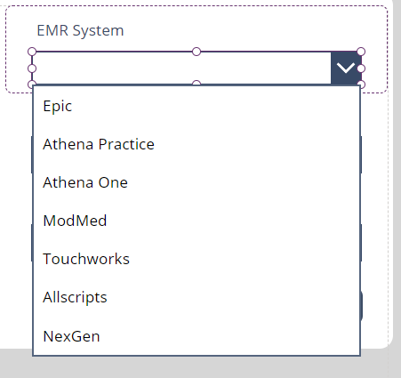

# [General Info on miscellaneous components](@id Miscellaneous)

Here we present general info on components that are used throughout the project. 

## [Form Dropdowns](@id formDropdowns)

PowerApps forms originally define all fields as regular text inputs, so we have to define our own method to implement dropdown functionality. 



The image above is the EMR System Dropdown on the [Add New Client Section](@ref addClient). The process to add a new dropdown to these forms is as follows: 

- Select the desired DataCard on the form component and remove the Text Input element to change 
- Insert the dropdown element into the datacard 
- Change the **Update** property of the DataCard. For instance, for the dropdown in the image: 
```
DropdownEMR.Selected.'EMR System'
```
On the dropdown object: 
- The list of options is controlled by the **items** property, and it can be set by either a collection or a table. If the collection contains more than one column, the value to show can be chosen from the properties menu of the object. 
- The responsive features of the element are controlled on the Width, X, and Y properties: 

```
Parent.Width - 60 //Width
DataCardKey4.Y + DataCardKey4.Height + 5 //X
```

## [Multiselect Dropdowns](@id formMultiselect)
The general behavior of this component (referred as **Combo Box** in PowerApps Documentation) is the same as described in [Form Dropdowns](@ref formDropdowns). However, there are a few differences, which are listed below:

- **Search Feature**:  If the **IsSearchable** property of the Combo Box is set to **true**, you must specify the searchable fields from the table that defines the object's items in the **SearchFields** property. In previous tests I found that setting more than one searchable field leads to delegation warnings in the application which could cause crashes or errors if one works with large data bases (of more than 2000 entries).

- **Default Items**: In general, we set the default selected items of an object in the **Default** property, but in Combo Boxes it's necessary to work with the **DefaultSelectedItems** property, which requires a table or collection as an input:

```
ForAll(Split(Parent.Default,"|") As ItemMentor,
LookUp('OPT - Employees Informations',Name=ItemMentor.Value)
)
```


## [Update or Add new a Element on a form](@id formNewAdd)
PowerApps forms can either add a new record or edit an existing one from a table by setting the **Item** and **DefaultMode** properties of the Form object. To control the desired behavior, we typically pass a context variable, which is either blank or of the record type, before navigating to the window containing the desired form. In the [Client's Section](@ref ClientsSection), for example, we pass this context variable as blank to add a new client, and as **ThisItem** when accessing to an existing Client record. 

```
//For entering a new record
Set(
    varDataEditCustomer, 
    Blank());

Navigate(scrAddCustomer,ScreenTransition.Fade,{varDataEditCustomer:varDataEditCustomer});


//For editing an exisiting one
Set(
    varDataEditCustomer, 
    ThisItem
);

Navigate(scrAddCustomer,ScreenTransition.Fade,{varDataEditCustomer:varDataEditCustomer});

```

We then set the **DefaultMode** property of the form as: 
```
If(IsBlank(varDataEditCustomer), FormMode.New, FormMode.Edit)
```

And the **Item** property as:

```
If(IsBlank(varDataEditCustomer), FormMode.New, FormMode.Edit)
```


## [Submit a form](@id formSubmit)
To validate and add or edit a record in a table, it is sufficient to use the **SubmitForm** functionality on a button, but this doesn't reset the form component or allow for further functionality after the form has been submitted. 

We use the **OnSuccess** and **OnFailure** properties of the form object to define window's behavior after submission. For instance, in the [Client's Section](@ref ClientsSection) we simply reset the form and notify the user after a successful entry: 

```
ResetForm(FormNewClient);
Notify("Client Added to Database", NotificationType.Success);
Back();
```

And in the case of failure: 

```
Notify("An error has occurred", NotificationType.Error);
```

In our experience, failures can occur due to an invalid data type being entered in one of the fields, or because the application was left open for a long period without any activity, and in some instances it seems that errors occur simply because multiple users tried to entered information simultaneously, which we have also observed when using the **Patch** command to edit or add a record to a table. 


## [Navigation bar Buttons](@id NavigationButtonms)


A series of buttons at the top of the window can be found in the  [Employee Profile](@ref EmployeeProfileScr) and [Administration](@ref AdminScr) sections. These buttons serve as navigation tools across different screens within a specific section. We use two different colors to indicate whether a section  is currently selected—**RGBA(64, 92, 123, 1)** for selected and **RGBA(112, 143, 174, 1)** for unselected—implemented through the Fill property of each button. Each button was manually added and calls a **Navigate** function. In certain cases, such as the Attachments section, they also pass context variables. 

```
Navigate(scrAttachments,ScreenTransition.CoverRight,{UserRole:UserRole,varEmployeeDataRow:varEmployeeDataRow})

```
